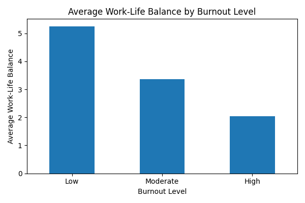
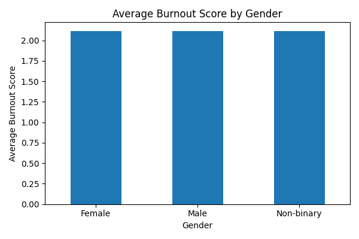
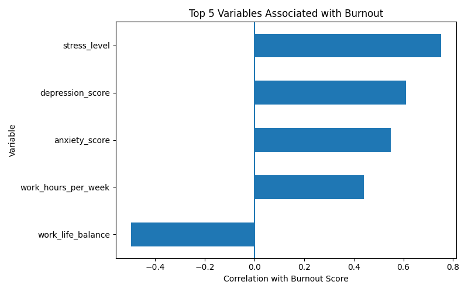
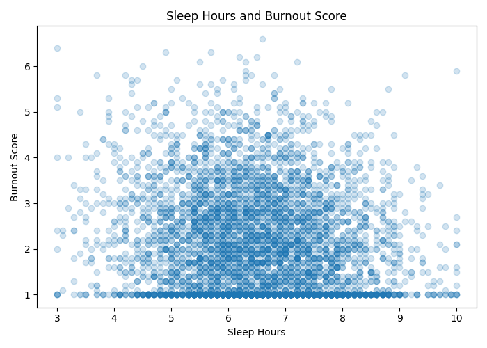
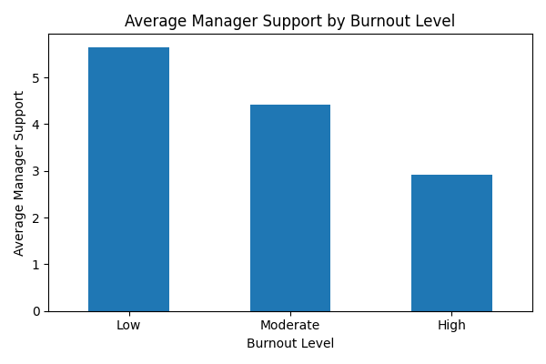
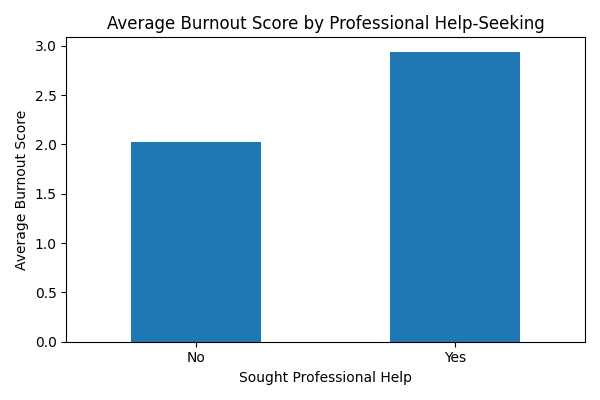
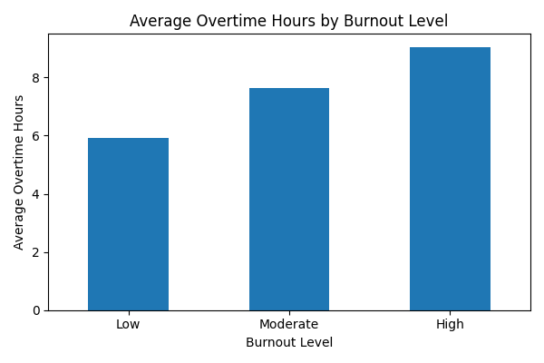

# Employee Burnout Analysis

This project explores workplace and psychological factors associated with employee burnout using Python.

The analysis focuses on work-life balance, gender, stress, sleep, manager support, professional help-seeking, and overtime hours.

## Tools Used

- Python
- Pandas
- Matplotlib
- Exploratory Data Analysis
- Correlation Analysis
- Data Visualization

## Dataset

The dataset contains 150,000 synthetic employee records and 25 variables related to workplace conditions, lifestyle, mental health, and burnout.

Dataset source: [Employee Mental Health & Burnout Dataset on Kaggle](https://www.kaggle.com/datasets/suhanigupta04/employee-mental-health-and-burnout-dataset)

## Research Questions

1. Does work-life balance differ across burnout levels?
2. Do average burnout scores differ across gender groups?
3. Which variables are most strongly associated with burnout?
4. Do people who sleep more have lower burnout?
5. Does manager support differ across burnout levels?
6. Do employees who seek professional help report different burnout scores?
7. Do overtime hours differ across burnout levels?

## Key Findings

- Employees with lower burnout levels had higher average work-life balance.
- Average burnout scores were very similar across gender groups.
- Stress level showed the strongest positive correlation with burnout.
- Work-life balance showed a strong negative correlation with burnout.
- Sleep hours had a weak negative correlation with burnout.
- Manager support decreased as burnout level increased.
- Employees who sought professional help reported higher average burnout scores.
- Average overtime hours increased from low to high burnout levels.

## Visualizations

### Work-Life Balance by Burnout Level

### Burnout Score by Gender

### Top Five Variables Associated with Burnout

### Sleep Hours and Burnout Score

### Manager Support by Burnout Level

### Professional Help-Seeking and Burnout

### Overtime Hours by Burnout Level

## Interpretation Notes

The results describe associations and group differences within this dataset. They should not be interpreted as evidence of causation.

## Project Files

- burnout_analysis.py — Python analysis code
- README.md — Project overview and findings
- PNG files — Saved visualizations

## Skills Demonstrated

- Data loading and inspection with Pandas
- Descriptive analysis
- Group comparison using groupby()
- Correlation analysis
- Data visualization with Matplotlib
- Research-oriented interpretation of workplace wellbeing data